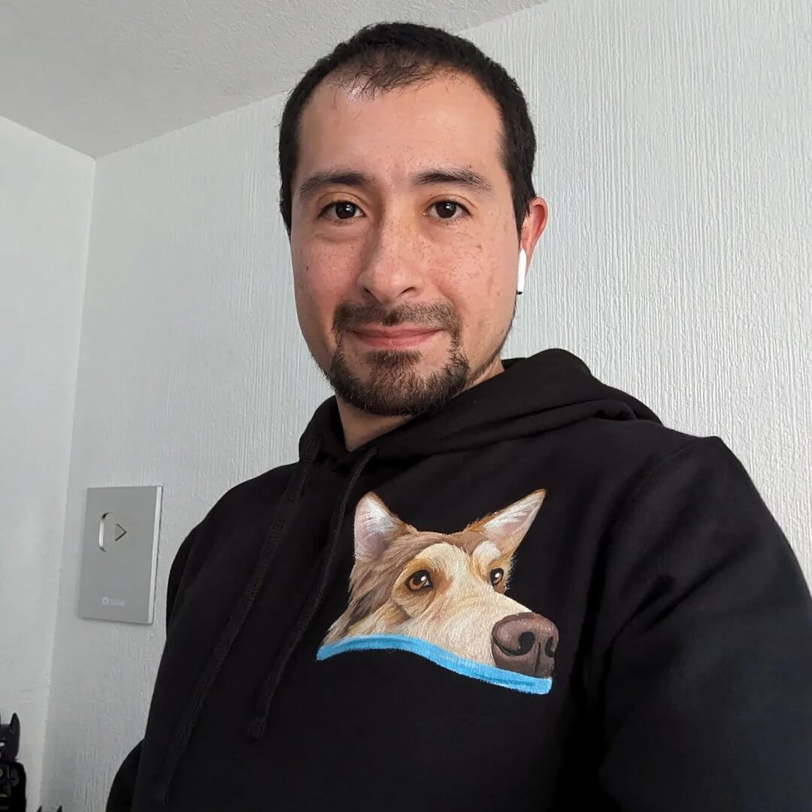
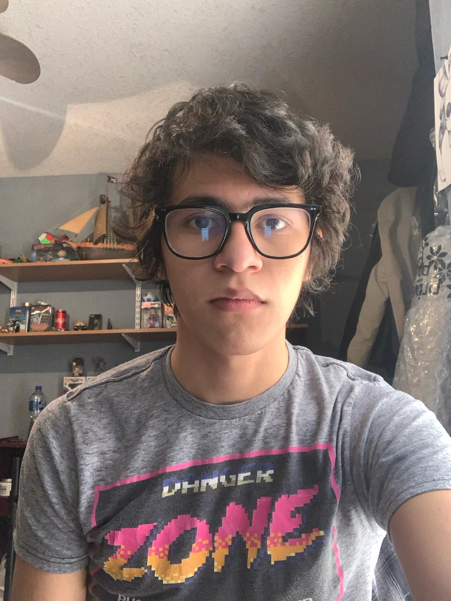

# Datos de _Amerike 3DEV_

## Profesor

### Jonathan MirCha

Hola soy tu amigo y docente digital.

- [jonmircha@gmail.com](jonmircha@gmail.com)
- [Tu perfil de _GitHub_](https://github.com/jonmircha)
  

---

## Estudiantes

### Sergio Santiago Salazar Ramírez

Me llamo Sergio Santiago Salazar Ramírez, tengo 20 años y nací el 5 de mayo de 2003, hasta ahora, he cursado la preparatoria y me encuentro estudiando la carrerra.

A lo largo de mi vida he entrenado:

- natación
- karate
- futbol
- taekwondo
- gimnasia
- acabo de entrar a box

mi correo es:

- cdmx2580@amerike.edu.mx

mi perfíl de github es:

- https://github.com/sssrcv

---

### Mauricio Arellano Tsimogianis

Mi nombre es Mauricio soy estudiante de Ingenieria en desarrollo de Software y Videojuegos. Tengo doble nacionalidad panameño-mexicano. Me gusta mucho el desarrollo de apps,videojuegos,paginas y mas y Me gusta mucho ayudar a los demas y aprender cosas nuevas cada dia.

- [cdmx2600@amerike.edu.mx](cdmx2600@amerike.edu.mx)
- [MATMaucio](https://github.com/MATMaucio)

---

### José Antonio Pérez Islas}

Ludopata, experto en la ruleta, jugador compulsivo de Doom eternal y fanatico de Relatos de la noche

-[cdmx2623@amerike.edu.mx](cdmx2623@amerike.edu.mx)
-[Antonio1886](https://github.com/Antonio1886)

 

---

### Juan Daniel Primavera Garcia

Un apasionado estudiante de desarrollo de software interactivo y videojuegos en la Universidad Amerike. Con tan solo 18 años, ya estoy inmerso en el emocionante mundo de la creación de juegos.

- [cdmx2539@amerike.edu.mx](cdmx2539@amerike.edu.mx)
- [Tu perfil de _GitHub_](https://github.com/OakIsland22)

---

### Diego Adrián Ramírez Montaño

Hola soy estudiante de AMERIKE y me gusta jugar videojuegos y escuchar musica, y salir con los compas.

- [diegoadrian_rmz@hotmail.com](diegoadrian_rmz@hotmail.com)
- [Mi perfil de GitHub](https://github.com/TouringChutoy)
  

---

### Diego Ricardo Wolf Cruz

No hay nada muy interesante sobre mi o lo que hago, pero lo intento ._.

- [wolfcruz143@gmail.com](wolfcruz143@gmail.com)
- [Mi perfil de _GitHub_](https://github.com/UwUolf)

---

### María Fernanda Vásquez Alatriste González

Soy una estudiante de Desarrollo de Software Interactivo y Videojuegos con gran interés en el desarrollo web.

- [cdmx2571@amerike.edu.mx](cdmx2571@amerike.edu.mx)
- [MaferVAG](https://github.com/MaferVAG)

---

### Leonardo Ramírez

Hola soy Leo, me gustan los videojuegos y la pizza.

- [leoragut@gmail.com](leoragut@gmail.com)
- [Tu perfil de _GitHub_](https://github.com/LeeonDeChino)
  

---

### Jorge Alberto Palacios Burguete

Hola, soy estudiante de Amerike en ingenieria en desarrollo de software.

- [jorgealberto140101@hotmail.com](jorgealberto140101@hotmail.com)
- [Tu perfil de _GitHub_](https://github.com/ElYorchi14)

---
  ### Rajid Luan Dokins Damiao 
 
   Hola, soy estudiante de Amerike, me gustan los videojuegos de mundo abierto y ver películas y series de ciencia ficción. 
 
   - [cdmx2605@amerike.edu.mx](cdmx2605@amerike.edu.mx) 
   - [Mi perfil de _GitHub_](https://github.com/RJDdd) 
 
    
 
   ---